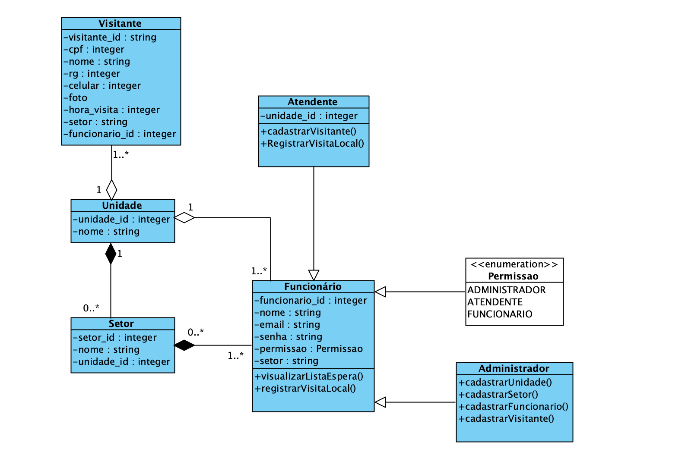

# Dashboard de Visitantes

## Requisitos Necessários:

* Ruby 3.0.0 ou Superior
* PostgreSQL
* Rails 7
* Devise
* Cancancan

## Funcionalidades

- A Funcionalidade proposta para cada classe está disponível no DER (Figura 1)
- Cadastro de usuários (Com os possíveis role: "Administrador", "Funcionário" ou "Visitante")
- Recuperação de senha via email
- Login de Usuário
- Cadastro de Visitantes
- Permissões distintas para cada role

```shell
class Ability
  include CanCan::Ability

  def initialize(user)

    if user.administrador?
      can :manage, :all  # Administrador tem todas as permissões
    elsif user.atendente? 
      can :read, :all  # Atendente tem permissão para ler todos os arquivos
      can :create, Visitante  # Assim como cadastrar novos visitantes
    elsif
      can :read, :all  # Já os Atendentes, apenas ler todos os arquivos.

    end
  end
end

```

## Executando o Projeto

### Settando o banco de dados
Nesta etapa, assume-se que já tenha o postgresql instalado. 
Caso não, aqui está um tutorial para [configuração de PostgreSQL em MacOS.](https://www.digitalocean.com/community/tutorials/how-to-use-postgresql-with-your-ruby-on-rails-application-on-macos)

Criando um novo role
```shell
createuser -P -d visitors_attendance  # Substituir <visitors_attendance> pelo nome do seu projeto
```

Passo extra (Opcional, mas recomendado)
- Registrando a senha em uma variável local (env)
```shell
echo 'export VISITORS_ATTENDANCE_DATABASE_PASSWORD="PostgreSQL_Role_Password"' >> ~/.bash_profile
```

No arquivo database.yml altere os seguintes campos:
- "visitors_attendance" -> Pelo seu role criado
- "password" -> Pela senha que foi definida na criação do Role.
```shell
default: &default
  adapter: postgresql
  encoding: unicode
  # For details on connection pooling, see Rails configuration guide
  # http://guides.rubyonrails.org/configuring.html#database-pooling
  pool: <%= ENV.fetch("RAILS_MAX_THREADS") { 5 } %>
  username: visitors_attendance
  password: <%= ENV['VISITORS_ATTENDANCE_DATABASE_PASSWORD'] %> 

development:
  <<: *default
  database: appname_development
```
### Clone esse repositório
```shell
gh repo clone VictorBenoiston/visitors_attendance
```

### Adicione as gems do devise e cancancan ao Gemfile (Case não estejam presentes)
```shell
gem 'devise'
gem 'cancancan'
```

### Instale as gems com o bundle
cd <nome_do_repo> 
bundle install
```

### Configure o Banco de Dados
Configure se banco de dados baseado no arquivo *database.yml* (Por default, estamos usando PostgreSQL).
Realize a criação do banco e execute as migrações
```shell
rails db:create
rails db:migrate
```
Dica de leitura para [configuração de PostgreSQL em MacOS.](https://www.digitalocean.com/community/tutorials/how-to-use-postgresql-with-your-ruby-on-rails-application-on-macos)

### Execute a aplicação
```shell
rails s
```

## DER - Diagrama de Classes Proposto

Figura 1: Diagrama de Classes em UML - DER (Autoria própria)
